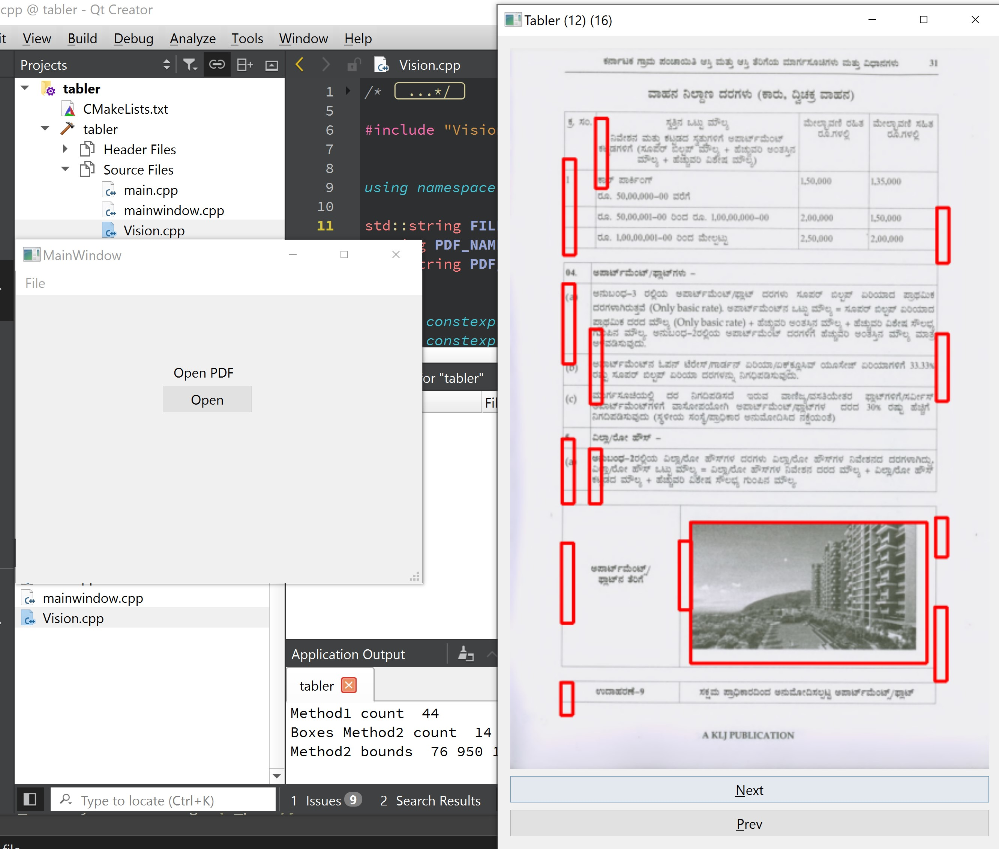

# ai4enablers
AI tools for enablers

AI tools for enablers working in various content conversion fields that are accessible to all.

Some examples:

1. An organisation working to convert printed books to Braille format using OCR

Project 1 - Tabler

A simple OCR tool to locate pages in PDF files, with tables. Lot of heuristic code.

Pre-requirements:

1. OS - Windows, Currently tested only on Windows. It can be made to work on other OS with a little bit of modifications.

2. OpenCV

Set OPENCV_DIR env variable to the complete path to the below folder

opencv\build

ie, the below folder should be available for linking

{OPENCV_DIR}\x64\vc15\bin

3. Qt5 / Qt creator

How to build:

- Open the Qt Makefile from tabler\CMakeLists.txt, and build the project.
- If all succeeds, it will generate tabler.exe

Run tabler and select an input PDF file.

Related:

- https://github.com/prabindh/viola
